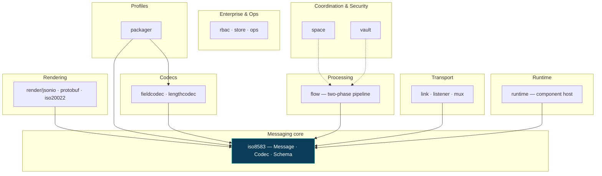

# Isopace

<p class="hero-tagline" markdown>
**A financial transaction framework for Go** — ISO-8583 messaging and payment
switching, plus the runtime, transaction pipeline, coordination, and security
building blocks needed to run a switch.
</p>

<p markdown>


</p>

[Get started :material-rocket-launch:](getting-started.md){ .md-button .md-button--primary }
[Architecture :material-sitemap:](architecture.md){ .md-button }
[GitHub :fontawesome-brands-github:](https://github.com/teqpace-services/isopace){ .md-button }

---

Isopace is an independent, **clean-room** implementation in the spirit of
[jPOS](https://jpos.org), redesigned around idiomatic Go: type-safe field
access, zero-copy decoding, a pluggable codec catalog, and goroutine-native
concurrency. The module is **stdlib-only** — there is no third-party dependency
anywhere in its graph.

!!! warning "Pre-1.0 — `v0.3.0`, the acquirer-profiles release"

    Feature-complete across the planned layers and tested under `-race`, but the
    API may change between minor versions (see the
    [versioning policy](versioning.md)). The software `Vault` backend is for
    development and testing — **production PIN and key handling require a
    certified HSM.**

## Why Isopace

<div class="grid cards" markdown>

-   :material-shield-check:{ .lg .middle } **Type-safe field access**

    ---

    `Get[iso8583.Decimal](m, 4)` and tag-bound structs instead of a
    stringly-typed `Map<Integer, ISOComponent>`. The type is known at compile
    time; money is exact fixed-point, never a float.

    [:octicons-arrow-right-24: The dual field API](architecture.md#3-the-dual-field-api)

-   :material-flash:{ .lg .middle } **Allocation-free hot path**

    ---

    Zero-copy lazy decode: fields are sub-slices of the source buffer. A
    store-and-forward hop returns the original wire **verbatim** when nothing is
    dirty — allocation-free end to end.

    [:octicons-arrow-right-24: Zero-copy decode](architecture.md#4-zero-copy-decode)

-   :material-puzzle:{ .lg .middle } **Composable codec catalog**

    ---

    `LengthCodec × FieldCodec` compose freely — ≈6 length × ≈12 value codecs
    replace jPOS's combinatorial `IF*` class zoo. Resolve by name from Go or
    JSON.

    [:octicons-arrow-right-24: Codec registry & catalog](architecture.md#6-fieldcodec--lengthcodec-registry--catalog)

-   :material-export:{ .lg .middle } **One model, many renderings**

    ---

    A single read-only `View` feeds every renderer: the same `*Message` projects
    losslessly to ISO-8583 wire, JSON, protobuf, and ISO 20022.

    [:octicons-arrow-right-24: Alternate renderings](architecture.md#8-alternate-renderings-view)

-   :material-check-decagram:{ .lg .middle } **Correct by construction**

    ---

    The bitmap is **always derived** from present fields, so desync is
    impossible. `Message` is immutable with copy-on-write; `Validate()` returns
    *every* violation in one pass.

    [:octicons-arrow-right-24: Schema & validation](architecture.md#5-schema--validation-model)

-   :material-cube-outline:{ .lg .middle } **stdlib-only, by design**

    ---

    No third-party dependency in the module graph. That keeps the dual-license
    (AGPL-3.0 / commercial) model free of transitive copyleft.

    [:octicons-arrow-right-24: Licensing](licensing.md)

</div>

## A switch in a few lines

```go
q := teq.New()
isw, _ := q.Switch(connector.Config{Name: "isw", Addr: "isw.example:5000", Keyer: keyer})
up,  _ := q.Switch(connector.Config{Name: "up",  Addr: "up.example:6000",  Keyer: keyer})

q.Start(ctx)                                  // connectors dial in the background
resp, _ := q.To("isw").Request(ctx, frame)    // route by name; auto-reconnects
q.ListenAndServe()                            // or run as a daemon until SIGINT/SIGTERM
```

Build and read a message with compile-time types — no casting:

```go
s := packager.ISO87A()
c := iso8583.NewCodec(s)

m := iso8583.New(s)
_ = m.Set(0, "0200")
_ = m.Set(11, int64(123456))        // STAN
_ = m.Set(4, int64(2500))           // amount, minor units
wire, _ := c.Marshal(m, nil)

got, _ := c.Unmarshal(wire)
mti,  _ := iso8583.Get[string](got, 0)
stan, _ := iso8583.Get[int64](got, 11)
```

[:octicons-arrow-right-24: Full quickstart](getting-started.md)

## The stack

The framework is layered with a strict one-directional dependency rule: the core
model knows the wire format only through the `*Schema` it references, and every
renderer consumes one read-only `View`.



## Packages

| Layer | Package | Purpose |
|-------|---------|---------|
| Messaging | [`iso8583`](packages.md#iso8583) | Immutable, zero-copy `Message`; `Codec`; `Schema`; typed `Get[T]` and struct binding; exhaustive validation |
| Codecs | [`fieldcodec`, `lengthcodec`](packages.md#fieldcodec-lengthcodec) | Orthogonal value × length codecs (ASCII/EBCDIC/BCD/binary, BER-TLV) resolvable by name |
| Profiles | [`packager`](packages.md#packager) | ISO 8583:1987 A/B/C, 1993 A/B, Visa & Mastercard overlays, declarative loader |
| Rendering | [`render/*`](packages.md#render) | One message, many formats — from a read-only `View` |
| Transport | [`link`, `listener`, `mux`](packages.md#link-listener-mux) | Framed TCP (+TLS), graceful server, connection pool, request/response switch |
| Runtime | [`runtime`](packages.md#runtime) | Component host & lifecycle, deploy descriptors + hot redeploy, config, `slog`, observability |
| Processing | [`flow`](packages.md#flow) | Two-phase `Flow`/`Stage`/`Exchange` pipeline: routing, journaling, retry, idempotency |
| Coordination | [`space`](packages.md#space) | Keyed tuple space + durable, crash-safe store-and-forward |
| Security | [`vault`](packages.md#vault) | PIN blocks, MAC/CMAC, DUKPT, TR-31 key blocks, EMV ARQC/ARPC behind a `Vault` façade |
| Enterprise/Ops | [`rbac`, `store`, `ops`](packages.md#rbac-store-ops) | RBAC + PBKDF2 auth, persistence, health/metrics/admin API, cluster membership |

## Why not just use jPOS?

jPOS is excellent and battle-tested, but it is Java/AGPL and carries 25 years of
design history. Isopace is a **from-scratch Go implementation** that keeps what
makes jPOS great while improving on its data model — compile-time type safety,
zero-copy parsing, an always-derived bitmap, first-class validation, and
multi-format rendering — and operating naturally in cloud-native, high-throughput
Go services. It is **not** a translation or port of jPOS: it is built clean-room
from the ISO-8583 standard and public payments knowledge, with no jPOS source
consulted.

[:octicons-arrow-right-24: How Isopace improves on jPOS](architecture.md#9-how-this-beats-jpos)

---

<small markdown>
A product of **[Teqpace Services Ltd.](https://teqpace.com)** ·
Dual-licensed [AGPL-3.0-or-later](licensing.md) & commercial ·
[Report a vulnerability](security.md)
</small>
